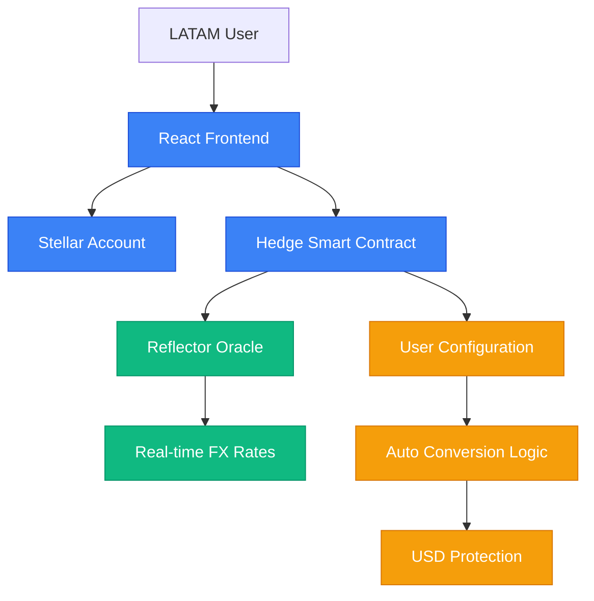

# Hedge

Automated currency protection for LATAM using Stellar and Reflector oracles.

<p align="center">
  
</p>


## Overview

Hedge protects your purchasing power by automatically converting a portion of your salary to USD and/or XML when your local currency weakens beyond a configurable threshold. Built on Stellar with real-time exchange rates from Reflector oracles, targeting LATAM workers and professionals facing currency devaluation.

### Supported Currencies
- 🇦🇷 ARS (Argentine Peso) - Testnet available
- 🇧🇷 BRL (Brazilian Real) - Mainnet ready
- 🇵🇪 PEN (Peruvian Sol) - Mainnet ready
- 🇨🇱 CLP (Chilean Peso) - Coming soon
- 🇲🇽 MXN (Mexican Peso) - Coming soon
- 🇨🇴 COP (Colombian Peso) - Coming soon

## How It Works

### Architecture



**Components:**
- **Smart Contract**: Soroban contract with Reflector oracle integration
- **Frontend**: React + TypeScript with mobile-first, intuitive interface
- **Oracle Integration**: Reflector for real-time forex and crypto price feeds
- **Storage**: Persistent user configurations and conversion history

### Key Features

- **Automatic Triggers**: Conversions triggered by currency devaluation thresholds
- **Real-time Rates**: Live exchange rates via Reflector oracles
- **Non-custodial**: Users maintain control of their funds
- **Mobile-first**: Optimized for mobile usage patterns
- **Historical Tracking**: Complete protection and conversion metrics

## Quick Start

### Prerequisites

- Node.js 18+
- Rust and Soroban CLI
- Stellar CLI configured with testnet account

### Installation

1. **Clone and setup**
   ```bash
   git clone https://github.com/yourusername/hedge.git
   cd hedge
   ```

2. **Install dependencies**
   ```bash
   npm install
   cd frontend && npm install && cd ..
   ```

3. **Configure environment**
   ```bash
   cp .env.example .env
   # Update .env with your configuration
   ```

4. **Build and deploy contract**
   ```bash
   cd contracts/hedge
   cargo build --target wasm32-unknown-unknown --release
   stellar contract deploy --wasm target/wasm32-unknown-unknown/release/hedge_contract.wasm --source alice --network testnet
   ```

5. **Start development server**
   ```bash
   cd ../../frontend
   npm run dev
   ```

## Test Credentials

For testing the application, use the following testnet configuration:

- **Network**: Stellar Testnet
- **Test Account**: Alice (configured via Stellar CLI)
- **Contract Address**: `CCQYSKW4OZRDB7WGHTMZLKBP3QZB32RLHZQQIZ235GZRAMUJTA63TXCV`
- **Oracle Address**: `CAVLP5DH2GJPZMVO7IJY4CVOD5MWEFTJFVPD2YY2FQXOQHRGHK4D6HLP`

To configure Alice account:
```bash
stellar keys generate alice --network testnet
stellar keys fund alice --network testnet
```

## Smart Contract Functions

### Core Functions

- `setup_protection(user, currency, percentage, threshold)` - Configure user protection
- `process_salary(user, amount)` - Process salary and trigger conversions if needed
- `get_config(user)` - Retrieve user configuration
- `get_metrics(user, days_back)` - Get protection metrics
- `get_metrics_mock(user, days_back)` - Mock metrics for testnet testing

### Example Usage

```bash
# Setup protection for ARS with 25% conversion at 2% devaluation
stellar contract invoke --id CCQYSKW4OZRDB7WGHTMZLKBP3QZB32RLHZQQIZ235GZRAMUJTA63TXCV \
  --source alice --network testnet --send=yes \
  -- setup_protection \
  --user $(stellar keys address alice) \
  --local_currency ARS \
  --target_percentage 25 \
  --threshold_bp 200

# Check configuration
stellar contract invoke --id CCQYSKW4OZRDB7WGHTMZLKBP3QZB32RLHZQQIZ235GZRAMUJTA63TXCV \
  --source alice --network testnet \
  -- get_config --user $(stellar keys address alice)
```

## Deployed Contracts

### Testnet
- **Contract Address**: `CCQYSKW4OZRDB7WGHTMZLKBP3QZB32RLHZQQIZ235GZRAMUJTA63TXCV`
- **Network**: Stellar Testnet
- **Oracle**: `CAVLP5DH2GJPZMVO7IJY4CVOD5MWEFTJFVPD2YY2FQXOQHRGHK4D6HLP`
- **Explorer**: [Stellar Expert Testnet](https://stellar.expert/explorer/testnet/contract/CCQYSKW4OZRDB7WGHTMZLKBP3QZB32RLHZQQIZ235GZRAMUJTA63TXCV)

### Mainnet (Planned)
- **Status**: Ready for deployment
- **Oracle**: `CALI2BYU2JE6WVRUFYTS6MSBNEHGJ35P4AVCZYF3B6QOE3QKOB2PLE6M`
- **Supported Assets**: ARS, BRL, PEN tokens available

## Why We Built It This Way

### Problem Statement
LATAM workers face significant purchasing power erosion due to currency devaluation. Traditional hedging solutions are either unavailable, expensive, or too complex for individual users.

### Technical Decisions

1. **Stellar Blockchain**: Lower transaction costs and better financial infrastructure for LATAM
2. **Reflector Oracles**: Reliable, decentralized price feeds specifically designed for Stellar
3. **Automatic Triggers**: Reduces manual intervention and emotional decision-making
4. **Mobile-first Design**: Matches usage patterns of target demographic
5. **Threshold-based System**: Balances protection with transaction costs

### Smart Contract Architecture

The contract uses a threshold-based system to minimize unnecessary conversions while providing protection:

- **Configurable thresholds**: Users set their own risk tolerance
- **Time delays**: Prevents over-trading during volatile periods
- **Mock functions**: Enables testing when oracle data unavailable
- **Address-based tokens**: Direct integration with Stellar asset contracts

## Development

### Project Structure
```
hedge/
├── contracts/hedge/          # Soroban smart contract
│   ├── src/
│   │   ├── lib.rs           # Main contract logic
│   │   ├── reflector.rs     # Oracle integration
│   │   ├── storage.rs       # Data persistence
│   │   └── types.rs         # Type definitions
│   └── Cargo.toml
├── frontend/                # React frontend
│   ├── src/
│   │   ├── App.tsx          # Main application
│   │   ├── hooks/           # Custom hooks
│   │   └── utils/           # Utilities
│   └── package.json
└── docs/                    # Documentation
```

### Testing

```bash
# Test smart contract
cd contracts/hedge
cargo test

# Test frontend
cd frontend
npm test

# Integration testing on testnet
npm run test:integration
```

## Roadmap

- **MVP** — Target date: **October 2024**  
  Basic protection setup, manual conversions, testnet deployment

- **Beta** — Target date: **December 2024**  
  Automatic conversions, mainnet deployment, ARS/BRL/PEN support

- **V1** — Target date: **Q1 2025**  
  Full LATAM currency support, advanced analytics, mobile app

## Built For

**Stellar Hacks: KALE x Reflector Composability Hackathon**

Demonstrating real-world composability by building directly on Reflector's oracle infrastructure to solve actual problems faced by LATAM workers and professionals.

## Contributing

1. Fork the repository
2. Create a feature branch
3. Implement changes with tests
4. Submit a pull request

All contributions require code review and security assessment.

## License

MIT License - see [LICENSE](LICENSE) for details.

## Security

Report security vulnerabilities to security@hedge.io. Do not create public issues for security concerns.

## Support

- **Documentation**: [docs/](docs/)
- **Issues**: [GitHub Issues](https://github.com/yourusername/hedge/issues)
- **Discord**: [Hedge Community](https://discord.gg/hedge)

---

**Disclaimer**: This is experimental software. Users should understand the risks involved in automated currency conversion and DeFi protocols. Always test with small amounts first.
